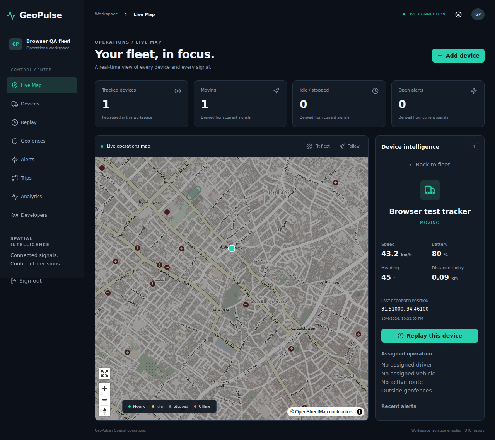
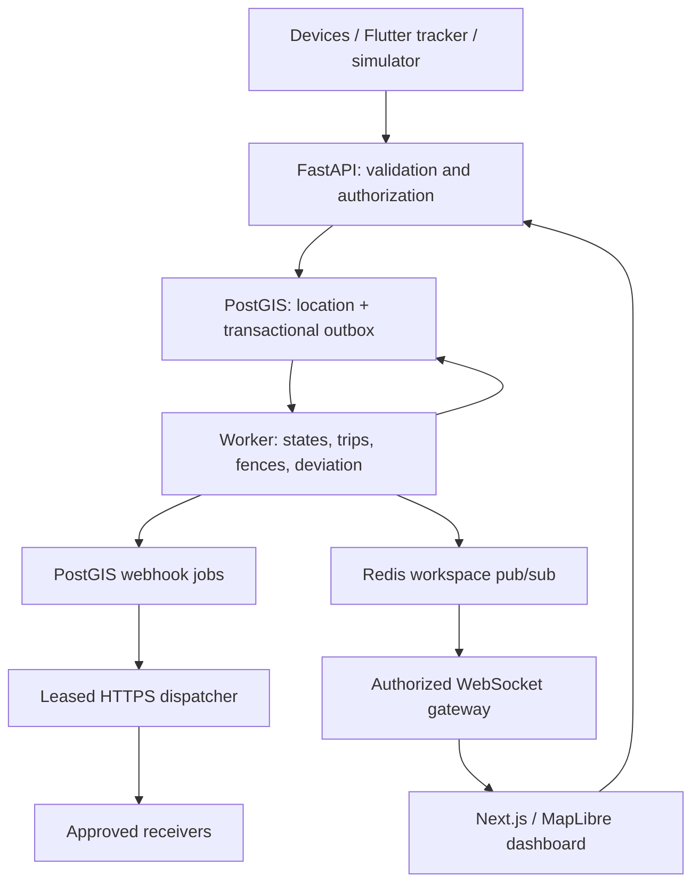

# GeoPulse

**A self-hosted geospatial operations platform built around real GPS signals.**

GeoPulse persists device locations in PostgreSQL/PostGIS, processes operational events through a transactional outbox, and broadcasts workspace-scoped updates through Redis and authenticated WebSockets. The dashboard uses MapLibre native layers and clustering; its historical player advances by recorded timestamps.

> **v0.1.0 — verified engineering foundation, not a completed production release.**
> The core ingestion → PostGIS → worker → Redis → WebSocket pipeline is operational and tested. The larger product brief remains the roadmap. Flutter background tracking, full workflow coverage and release validation remain pending. Signed webhooks now have durable delivery, retries and SSRF protection.

## Operational dashboard



Captured against the running Compose stack with two persisted GPS events from an authenticated tracker. The second location reached the dashboard over WebSocket; the test also checks native map rendering. The demo workspace in this screenshot contains one test device. Run the simulator for a moving fleet.

## Quick start

Requires Docker Engine and Docker Compose v2. No public database or Redis ports are opened.

```sh
python3 scripts/init-env.py
docker compose up -d --build --wait
docker compose run --rm simulator
```

Open **http://localhost**, then sign in using `SIMULATOR_EMAIL` and `SIMULATOR_PASSWORD` from your generated `.env`. The simulator registers the demo workspace, creates devices and a depot geofence, and sends real GPS updates. It must keep running to keep the fleet moving.

The web interface also supports creating an empty workspace and provisioning a device without demo data. There are no seeded static movement markers. A device token appears once at creation; copy it to your tracker securely.

```sh
docker compose run --rm simulator python -m simulator.main \
  --devices 100 --interval 2s --seconds 120 --scenario normal
```

The simulator service does not automatically start with the main stack. `--seed` creates demo teams, a driver, a vehicle and a depot fence. A repeat seed run adds demo entities; it is not a destructive reset.

## Implemented in this milestone

| Area | Working implementation | Current boundary |
|---|---|---|
| Identity | Argon2 passwords, JWT access, hashed refresh tokens, rotation and reuse detection | No email verification or password recovery transport |
| Workspaces | Creation, invitations, membership roles, server enforcement, composite tenant foreign keys | Owner transfer/deletion workflows pending |
| Devices | Provisioning, one-time token display, token rotation, assignments, activation, heartbeat | Command lifecycle schema only |
| GPS ingestion | Single/batch input, UUID deduplication, timestamp/coordinate/accuracy checks, real PostGIS storage | Batch currently loops inserts in one transaction |
| Realtime | Durable server outbox, Redis pub/sub, one-time WebSocket tickets, reconnect/resync in web | No durable client event resume cursor |
| Spatial processing | Circle/polygon fences, enter/exit/dwell, states, stop/trip detection | Late older points do not rebuild derived historical events |
| Routes | OSRM adapter, assignment, actual distance-based deviation, baseline ETA | Requires prepared self-hosted routing dataset; no road-data bundle included |
| Optimization | Deterministic nearest-neighbour + 2-opt | Haversine distance, not road-time/VRP optimization |
| Spatial queries | PostGIS radius search, historical grid heatmap | Full polygon/closest/route search UI pending |
| Dashboard | Live clustered map, state filter/search, follow/fit, device panel, polygon drawing, replay, alerts, trips CSV | Team/type filters, route editor and many management screens pending |
| Developer API | OpenAPI, scoped hashed API keys, audit, saved views, signed durable webhooks and delivery history | Broader SDKs pending |
| Privacy | Explicit foreground consent, disable device, delete device history, retention for GPS and derived history | Full-device exports and completed privacy UX pending |
| Mobile | Operator map/polling, secure token store, foreground tracking, SQLite offline batch queue | Analyzer/queue/widget tests passed; physical hardware and background tracking pending |

## Architecture



Tech: Python 3.12, FastAPI, psycopg async pools, PostgreSQL 16/PostGIS, Redis, Next.js 16/React/TypeScript, MapLibre GL JS, Flutter, SQLite, OSRM, Caddy, Prometheus. Dependencies and npm lockfile are included.

## Source layout

```text
apps/api/         API, migrations, tests
apps/worker/      Durable spatial event processing
apps/simulator/   Real GPS producer and scenarios
apps/web/         Operational dashboard and Playwright specs
apps/mobile/      Flutter operator/tracker foundation
packages/geospatial/  Distance, operational state, route heuristic
packages/sdk/         Python device client
infra/                Docker, Caddy, Prometheus
scripts/              Environment setup, mobile bootstrap, load test
```

## Local development

Use the Docker stack for PostGIS, Redis and the worker. For an API outside Docker, install `apps/api/requirements-dev.txt`, set `DATABASE_URL`, `REDIS_URL`, `JWT_SECRET`, and `PYTHONPATH=apps/api:apps:packages`, then:

```sh
python -m geopulse.migrate
uvicorn geopulse.main:app --reload
# separate terminal, same environment
python -m worker.main
# web
cd apps/web
npm ci
npm run dev
```

Permit `http://localhost:3000` in `CORS_ORIGINS` for direct development. Local Next.js proxies HTTP API requests; use `NEXT_PUBLIC_WS_URL=ws://localhost:8000/api/v1/realtime` **at build/dev startup** if your development reverse proxy does not forward WebSocket upgrades. Production Caddy routes upgrades directly to the API.

Flutter setup and current limitations: [apps/mobile/README.md](apps/mobile/README.md).

## API example

The device token does not grant workspace read access. Operator REST requests use a user access token or scoped workspace API key plus `X-Workspace-ID`.

```sh
curl -X POST http://localhost:8000/api/v1/locations \
  -H "Authorization: Bearer $DEVICE_TOKEN" \
  -H 'Content-Type: application/json' \
  -d '{"event_id":"c6ea94e1-04d0-44d7-836f-238d5051e0ba","recorded_at":"2026-10-04T21:00:00Z","lng":34.46,"lat":31.51,"speed":8,"bearing":90,"accuracy":5,"source":"gps"}'
```

Use a current original UTC timestamp in real requests. Old timestamps outside workspace retention are filtered. Swagger UI: `/docs`; schema: `/openapi.json`.

## Tests and evidence

The current local evidence is **50 passing backend tests**, including real PostGIS/Redis integration tests, **4 passing replay tests**, passing Ruff/mypy, TypeScript checking and Next.js production build. See [docs/VALIDATION.md](docs/VALIDATION.md) for the exact evidence and what was not executed.

A measured run used 100 devices, updates every 2 seconds, and 3 WebSocket clients. All 1,000 accepted points reached every client, with no HTTP errors. Measured latency and resource scope are recorded in [docs/load-test-result.json](docs/load-test-result.json), not estimated. This short local test is not a production sizing guarantee.

All seven GitHub Actions jobs passed on [run 37240412037](https://github.com/The-Null-Catchers/GeoPulse/actions/runs/37240412037): backend, web, Flutter, Docker, browser integration, dependency audit and secret scan. Playwright verifies authenticated GPS ingestion, a second position delivered while device-list polling is blocked, and GPS features rendered in native MapLibre layers. Both Flutter tests and analyzer passed. See [validation evidence](docs/VALIDATION.md).

```sh
RUN_INTEGRATION=1 pytest -q
ruff check apps packages scripts
mypy apps/api/geopulse packages/geospatial apps/worker apps/simulator --explicit-package-bases
cd apps/web && npm run typecheck && npm test && npm run build
```

## Deployment and engineering notes

- [Architecture and decisions](docs/ARCHITECTURE.md)
- [Geospatial engine and correctness limits](docs/GEO_ENGINE.md)
- [Realtime delivery semantics](docs/REALTIME.md)
- [Signed webhooks, receiver verification and retries](docs/WEBHOOKS.md)
- [Security and privacy](docs/SECURITY.md)
- [Deployment and OSRM data preparation](docs/DEPLOYMENT.md)
- [Load testing and scaling](docs/LOAD_TESTING.md)
- [Validation and remaining milestones](docs/VALIDATION.md)

## Next release gates

Complete mobile platform scaffolding and background lifecycle, integration-test the OSRM adapter against a real road dataset, rebuild derived histories after late points, expand management workflows/reports/search, and execute browser/hardware/security/release tests. Time partitioning and bulk-write optimization should follow measured requirements, with a 1,000-device soak run before any larger-scale claim.
